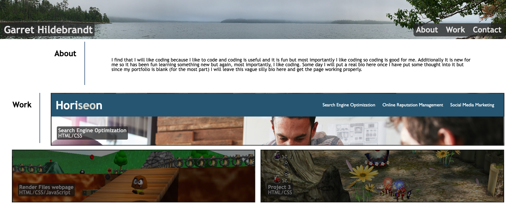

# Porfolio-challenge

## Description

This is my portfolio webpage that is meant to showcase my past completed work alongside information about myself. It is meant to be visible on all screen sizes and includes some links to expternal pages such as my github profile. 

## Installation

N/A

## Usage

In the header there is a nav bar that can be used to direct you around the webpage. If you click one of the three options it will scroll to the corresponding section. If you click on the card items in the 'work' section it will direct you to that projects live page. In the 'contact' section you will be directed to my github page if you click on 'Github'.

## Credits

N/A

## License

Please refer to the LICENSE in the repo.

